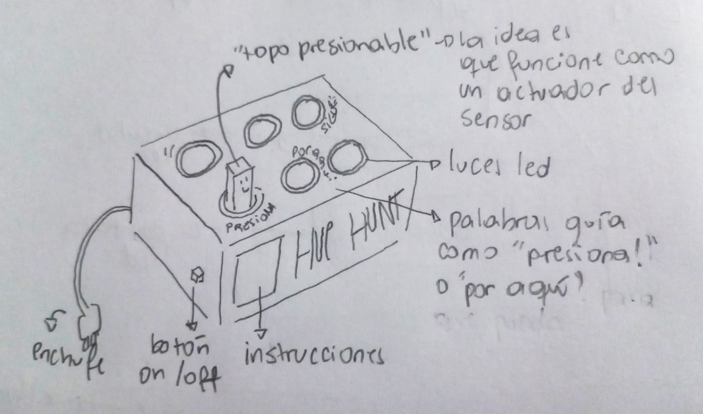

# clase-03
## HUE HUNT 

Con [@SofiaEct](https://github.com/SofiaEct/dis8637-2024-2)  ideamos el proyecto __"HUE HUNT"__ que trata de un juego interactiovo que combina el reconocimiento de color, inspirado por el juego _“whack-a-mole”_. El objetivo del juego es ayudar a los jugadores a mejorar sus habilidades cognitivas, como la memoria y reconocimiento de patrones y colores como lo sería el juego_”pop it”_. A medida que los jugadores avanzan los patrones de color, estos aumentan en dificultad. 

El propósito principal de "HUE HUNT" es desarrollar y mantener las habilidades motoras finas y reflejos, especialmente en grupos etarios que pueden encontrar desafíos particulares en estas áreas, como niños en desarrollo y adultos mayores. Al enfocarse en la velocidad de reacción y la coordinación ojo-mano, el juego ofrece un entrenamiento cognitivo y físico divertido y accesible.

## REFERENTES

***Ejemplo del juego whack-a-mole***

***Ejemplo del juego pop it***

https://github.com/user-attachments/assets/cc712618-53b4-4c0d-a535-d1b04aa49962

## DISEÑO Y MATERIALES

Ideamos el diseño del dispositivo como una caja de madera transportable, en la cual tendría sus respectivas instrucciones y guías gráficas para el uso del mismo.

***Boceto de "HUE HUNT"***

***Imagen de [@brandnewnoise](https://www.instagram.com/brandnewnoise)***

Materiales:
1. Madera
2. botones
3. luces led
4. interruptores
5. cables de conexion
6. etc

## JUGABILIDAD

Después de encender nuestro “HUE HUNT” veremos que se prenden los aros de luz alrededor de los “topos” estos una vez dejen de parpadear empezaran a crear una secuencia de colores que se debe de memorizar, para que así una vez termine esta secuencia, el jugador presione los “topos” en el orden correcto, pasando al siguiente nivel.

## REPOSITORIOS DE GITHUB

1. [Plaid-Pad](https://github.com/Keycapsss/Plaid-Pad) Es un teclado númerico. 
2. [ButtonDriver-](https://github.com/myles-parfeniuk/button_driver) Es una guía de como usar botones.
3. [ClickButton](https://github.com/marcobrianza/ClickButton) Es una biblioteca de botones en arduino.

# Clase

## tarea
Ayudar a compañeres con la iniciacion de actividades en el SII 

## Plan del día
Desarrollar tecnicamente el trabajo conceptual del encargo
