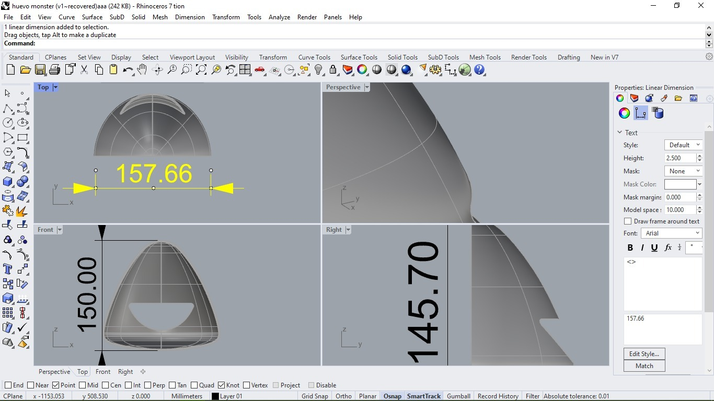
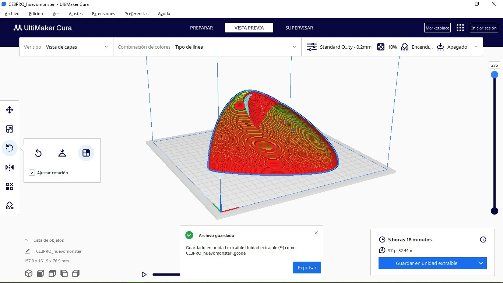
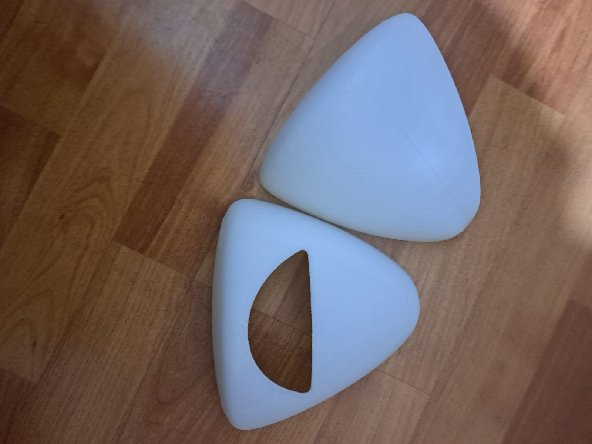
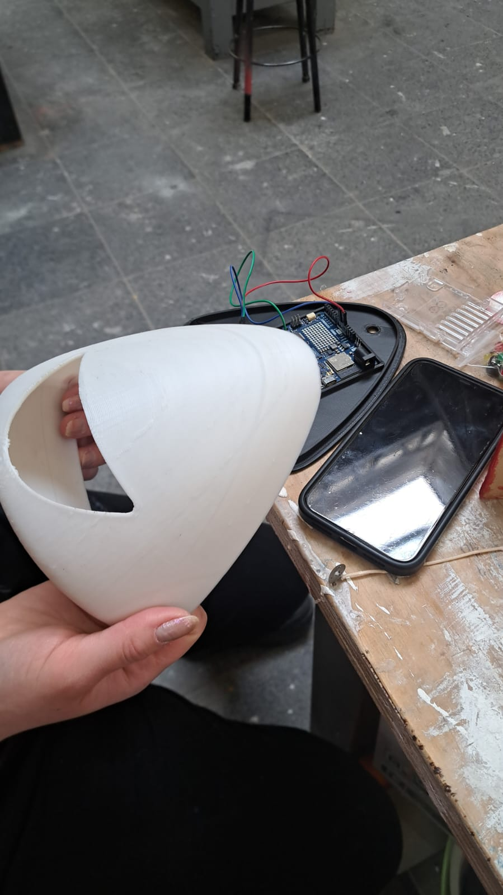

# clase-05
## Solemne 01
*El proyecto “Shh” explora la interacción con el entorno, permitiendo que una criatura aparentemente dormida despierte cuando detecta ruidos fuertes. La idea es que este objeto, que normalmente está inactivo, cobre vida en respuesta a estímulos sonoros, este enfoque busca ser interactivo y lúdico*

*El objetivo es que la matriz LED reaccione al ruido por un parametro establecido, permitiendo que la criatura exprese su estado a través de su ojo. La idea es que, al captar un cierto umbral de ruido, el ojo de la criatura se ilumine de manera que refleje su estado de ánimo. Dependiendo de la intensidad del sonido, la criatura podrá manifestar emociones como enojo o tristeza, utilizando el cambio en la iluminación y patrones visuales de la matriz LED para comunicar estas sensaciones.*

### Imágenes del proceso
## Boceto

## Construcción



## Resultado inicial



## resultados y cambios post correcciones curso
* Los cambios propuestos en clase para esta criatura incluyen varias mejoras. Primero, se sugirió que estuviera adherida a la pared para facilitar su interacción con las personas a su alrededor. Para lograrlo, diseñamos una placa que permite colgarla en el muro, con un agujero incorporado para facilitar su montaje. Además, se añadió un soporte específico para el Arduino y se creó un espacio adicional para proyectar de manera óptima, mejorando así la funcionalidad y la estética del diseño.
* El problema del tamaño de los Led fue resuelto con una lupa, la cual fue puesta en el ojo de la criatura, lo que permitió poder ampliar la luz y ver de mejor forma el ojo. 



¿Qué es "shh"?: Criatura que no quiere ser molestado, "shh" es sensible al sonido por lo que despierta tanto enojado como triste al sonido, la idea de "shh" es poder controlar lugares de niños en donde el 
# Manual de uso proyecto "shh"
### Paso 1: Encuentra un espacio adecuado
El primer paso es ubicar un espacio tranquilo, como una sala o una habitación, asegurándote de que haya el menor ruido ambiental posible. La criatura "Shh" es sensible al sonido, por lo que un entorno silencioso te permitirá interactuar mejor con ella.

### Paso 2: Colgar a "Shh" en la pared
Para utilizar el objeto, primero debes colgar a "Shh" en la pared. En la parte posterior del dispositivo, encontrarás un orificio en la tapa trasera que está diseñado para este propósito. El objeto utilizado para colgarlo debe tener un radio no mayor a 1 centímetro. Asegúrate de que esté bien sujeto para evitar caídas.

### Paso 3: Conectar a la fuente de energía
Una vez que hayas colgado a "Shh", revisa que esté correctamente conectado a una fuente de energía. Para comprobar que el dispositivo está encendido, observa si comienza a mostrar señales en su matriz LED. Si ves actividad en la matriz, sabrás que está listo para interactuar contigo.

### Paso 4: Despertar a la criatura
Para despertar a "Shh", simplemente emite algún sonido en el espacio o háblale directamente. La criatura es muy sensible al sonido, por lo que cualquier ruido captado por su sensor activará una respuesta.

 ### Paso 5: Cambios en el estado de ánimo
El estado de ánimo de "Shh" dependerá del nivel de ruido en su entorno. Si le hablas suavemente o emites sonidos tranquilos, su estado será neutral o triste. Sin embargo, si el ruido es muy fuerte, como cuando hay muchas personas hablando o si gritas, la criatura mostrará un estado de ánimo enojado. Su matriz LED reflejará estos cambios de humor, lo que hace que la interacción sea dinámica.

### Paso 6: Poner a "Shh" en reposo
Si deseas que "Shh" vuelva a dormir, asegúrate de que no haya ruido en su entorno. Una vez que el sonido desaparezca, la criatura entrará en un estado de reposo, apagando o disminuyendo la actividad en su matriz LED.

## Prohibiciones 
1. Asegurate que "shh" no sufra caídas, ni golpes.
2.  Asegúrate de que "Shh" no tenga contacto con agua ni ningún otro líquido. Este dispositivo no es resistente al agua, y cualquier exposición a líquidos puede dañarlo de manera irreversible. Siguiendo estas instrucciones y precauciones, podrás disfrutar de una experiencia óptima con la criatura "Shh", interactuando con ella de manera segura y divertida.
   

// 

``` cpp
#include "Arduino_LED_Matrix.h"   //Include the LED_Matrix library
#include "frames.h" //este archivo contiene los 3 frames 

ArduinoLEDMatrix matrix; 

const int pinSensor = 8; // aqui esta conectado el sensor de sonido
const int intervaloTiempo = 800; // con esto establecemos un intervalo de 1 segundo para medir el nivel de ruidom, cada un segundo toma una muestra
unsigned long millisCurrent; //estas variables las deje igual que en el video https://www.youtube.com/watch?v=PYkzJQhFNlA
unsigned long millisLast = 0; // unsigned long: numeros positivos y grandes, esto porque el valor que devuelve millis() puede volverse muy grande
unsigned long millisElapsed = 0;

int sampleBufferValue = 0;

const int umbralMedio = 5;
const int umbralAlto = 5000;

int frecuenciaActual = 1;


void setup() {

  Serial.begin(9600);
     matrix.begin();


}

void loop() {

  millisCurrent = millis();
  millisElapsed = millisCurrent - millisLast;

  if (digitalRead(pinSensor) == LOW) {
    sampleBufferValue++;
  }

  if (millisElapsed > intervaloTiempo) { //que solo se realice si ha pasado el tiempo suficiente (1 seg)

    if(sampleBufferValue < umbralMedio) { //si el valor de sampleBufferValue es menor que umbralMedio, esto significa que no hubo mucho ruido, por lo tanto estado: calmado
      matrix.loadFrame(calmado);
      Serial.print(sampleBufferValue);
      Serial.println(" CERRADO"); //antes de probar la matriz led, probé con esto en el monitor para saber si los parametros estaban funcionando
 
    }
    else if(sampleBufferValue >= umbralMedio && sampleBufferValue <= umbralAlto) { //si el valor de sampleBufferValue es mayor o igual que umbralMedio pero menor o igual que umbralAlto, estado: triste
      matrix.loadFrame(triste);
      Serial.print(sampleBufferValue);
      Serial.println(" TRISTE");
     

    } else if(sampleBufferValue > umbralAlto) { //si el valor de sampleBufferValue es mayor que umbralAlto, esto significa que hubo mucho ruido, por lo tanto estado: enojado
      matrix.loadFrame(enojado);
      Serial.print(sampleBufferValue);
      Serial.println(" ENOJADO");
  
    }

    sampleBufferValue = 0;
    millisLast = millisCurrent;
  }


}
```

``` cpp
//Codigo para matriz led ojo enojado
const uint32_t animationenojado[][4] = {
	{
		0x1f816,
		0x81681083,
		0xfc70ee07,
		66
	}
};


//Codigo para matriz led ojo calmado
const uint32_t animationcalmado [][4] = {
	{
		0x0,
		0x7fe8010,
		0x0,
		66
	}
};

//Codigo para matriz led ojo triste 
const uint32_t animationtriste [][4] = {
	{
		0x2001f816,
		0x81689097,
		0xfe000000,
		66
	}
};

```
