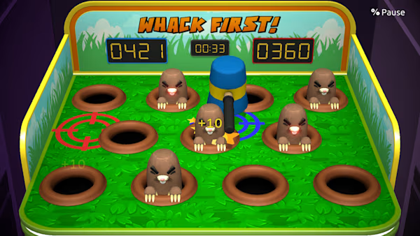
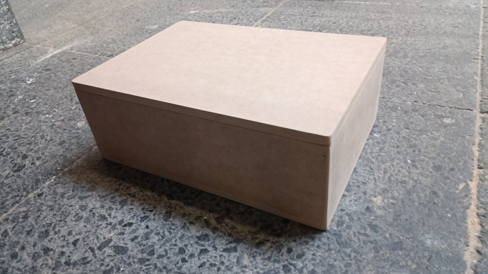
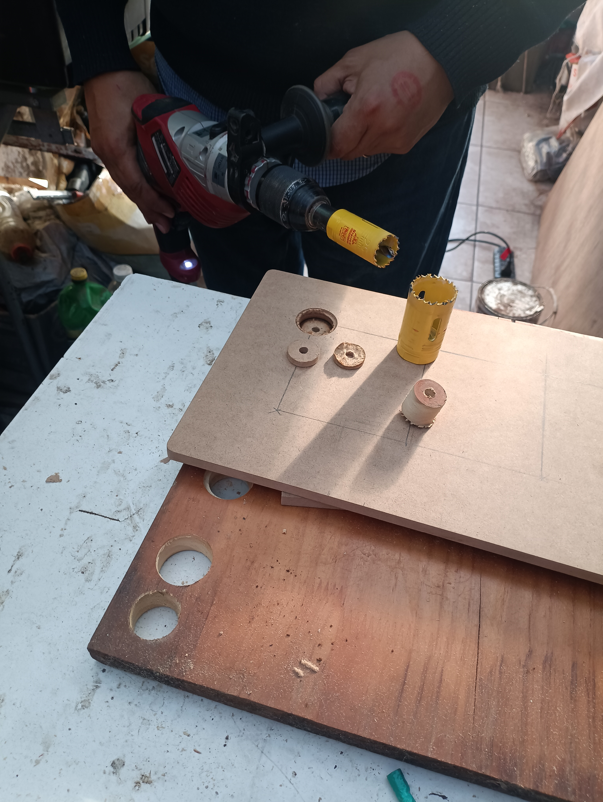

# clase-05
## VOCAL HUNT 

Con [@SofiaEct](https://github.com/SofiaEct/dis8637-2024-2)  ideamos el proyecto __"VOCAL HUNT"__ que trata de un juego interactivo que combina el tiempo de reacción y reflejos del jugador, inspirado por el juego _“whack-a-mole”_. El objetivo del juego es poner nervioso al jugador, ya que tiene un tiempo límite para presionar cada vocal como lo sería el juego_”pop it”_ y además funciona con vidas. A medida que los jugadores avanzan las secuencias, estos aumentan en dificultad. 

El propósito principal de "VOCAL HUNT" es desarrollar y mantener las habilidades motoras finas y reflejos, especialmente en grupos etarios que pueden encontrar desafíos particulares en estas áreas, como niños en desarrollo y adultos mayores. Al enfocarse en la velocidad de reacción y la coordinación ojo-mano, el juego ofrece un entrenamiento cognitivo y físico divertido y accesible.

## REFERENTES

***Ejemplo del juego whack-a-mole***



***Ejemplo del juego pop it***

https://github.com/user-attachments/assets/cc712618-53b4-4c0d-a535-d1b04aa49962

***Ejemplo de virtual sports play dance mat***


## DISEÑO Y MATERIALES

Ideamos el diseño del dispositivo como una caja de madera, en la cual tendría sus respectivas instrucciones y guías gráficas para el uso del mismo.

***Boceto de "VOCAL HUNT"***


***Imagen de [@brandnewnoise](https://www.instagram.com/brandnewnoise)***


***Materiales***

1. Madera mdf
2. Botones / pulsadores led Arcade
3. Arduino
4. Cables de conexión

***jugabilidad***

El jugador se enfrenta a un panel con 5 botones, cada uno representando una vocal (A, E, I, O, U). En la pantalla central se mostrará una secuencia de vocales que deberá seguir al pie de la letra. Cada vocal aparecerá con un temporizador que marca el tiempo límite para reaccionar. El jugador debe concentrarse y actuar con rapidez, presionando el botón correcto antes de que se agote el tiempo.

El jugador cuenta con 2 vidas, y perderá una cada vez que cometa un error o no presione el botón a tiempo. A medida que el juego avanza, las secuencias se vuelven más rápidas y complicadas, aumentando la presión. El reto consiste en mantener la calma y reaccionar con precisión, pues cuando las 2 vidas se agoten, el juego terminará.

## Construcción del objeto

Al principio intentamos hacer una estructura transportable, es decir pequeña. Primero lo intentamos hacer con impresión 3d donde [@AlanisMria](https://github.com/AlanisMria/dis8637-2024-2) me ayudo a modelar, con un tiempo de espera de 12 hrs y que terminó fallando
.

Descubrimos que falló porque confundimos un filamento ABS por uno PLA

Luego siguiendo con la idea de la transportabilidad hicimos una caja chiquita con la ayuda de mi papá


Al final no cabía ningún circuito en la caja así que se hizo una mas grande




para hacerle los agujeros requerimos de la ayuda de mi padre nuevamente



El problema de hacer los ahgujeros era que el MDF se quemaba y se pegaba en la broca demorandonos más en hacer todos los agujeros

https://github.com/user-attachments/assets/67e6b9ee-4b94-49aa-abf2-10c8dd6cbc03

## DIAGRAMA DE FLUJO

tarea: quiero jugar al juego de secuencia

casos limites:

1. Conecta al juego a una fuente de energía a través de un cable usb
2. El juego queda en un estado de espera hasta que el jugador inicie el juego apretando cualquier tecla/botón
3. Las letras que aparecerán en el arduino corresponderá a la vocales, debes de apretar el botón con la letra que se muestra en la pantalla
gradualmente aumenta la complejidad de este juego, disminuyendo los intervalos en los que se muestra la vocal y agregado a eso a animaciones que indiquen que se acaba el tiempo de reacción, hay un margen de error de 2 intentos, al equivocarse una tercera vez el juego vuelve al modo de espera, y para volver a empezar hay que presionar cualquier botón
4. Una vez acabadas las 2 vidas el juego volverá a un modo de espera o después de un tiempo considerable de no interacción
## CÓDIGO (DEFINICIONES Y OTRAS COSAS) :b

**definiciones de los códigos que utilizamossacadas de google + clases**

- ___const int___: significa constante. Es un calificador variable que modifica el comportamiento de la variable, haciendo que sea una variable de "sólo lectura". No es modificable.
- ___int___: variable modificable.
- ___pinMode___: sirve para configurar el modo de trabajo de un pin pudiendo ser INPUT (entrada) u OUTPUT (salida).
- ___digitalWrite___: sirve para establecer un valor de HIGH o LOW en un pin digital de Arduino siempre y cuando se haya configurado como salida (OUTPUT).
- ___switch___: evalúa una expresión de una lista de posibles coincidencias (los ___int___), cuando encuentra una correspondencia se ejecuta un bloque de instrucciones.
- ___break___: finaliza la ejecución de la instrucción do , for , ___switch o while___ más próxima que la incluya.
- ___Serial.println___: (estado) es el que nos permite enviar datos por comunicación serial.
- ___bool___:  Las variables de este tipo solo pueden tener dos valores: verdadero o falso, por ejemplo 0 o 1.
- ___Serial.begin___:  establece la velocidad de transmisión en baudios y se utiliza para indicar a la placa Arduino que está lista para enviar y recibir datos. No necesitamos más de 9600.
- ___void loop___: es la función principal, el punto de entrada a nuestro programa, es el lugar donde tenemos que poner los comandos que se ejecutarán mientras la placa Arduino esté habilitada.
- ___enum___: es una herramienta que nos proporciona el C++ para ayudarnos a detectar posibles errores en el código.
- ___false___: se define como 0 (cero), hay que tener en cuenta que las constantes true y false se escriben en minúsculas, a diferencia de HIGH, LOW, INPUT y OUTPUT.
- ___true___: comunmente se define como 1, lo cual es correcto, pero true tiene una definicion mas amplia, cualquier entero que no es cero es true.
- ___digitalRead___: sirve para leer un valor (o poner en un estado) un pin digital.

## DIAGRAMA DE FLUJO: ¡VOCAL HUNT!

1. conecta al juego a una fuente de energía a través de un cable usb
2. el juego queda en un estado de espera hasta que el jugador inicie el juego apretando cualquier tecla/botón
3. las letras que apareceran en el arduino corresponderan a la vocales, debes de apretar el botón con la letra que se muestra en la pantalla
4. gradualmente aumenta la complejidad de este juego, disminuyendo los intervalos en los que se muestra la vocal y agregado a eso a animaciones que indiquen que se acaba el tiempo de reacción, hay un margen de error de 2 intentos, al equivocarse una tercera vez el juego vuelve al modo de espera, y para volver a empezar hay que presionar cualquier botón
5. una vez acabadas las 2 vidas el juego volvera  a un modo de espera o despues de un tiempo considerable de no interaccion
  
## CODIGO PRINCIPAL CON ERRORES

 ```c++
// lenguaje de c++ para detectar posibles errores en el código y valores, por lo que lo usamos ahora para definir los estados de nuestro dispopsitivo
enum State {
  STANDBY,    // en espera
  ACTIVO,     // una vez se inicia el juego
  TRABAJANDO  // mientras el usuario juega con con 'vocal hunt' (mientras que este dentro del rango de vidas)
};

// el pin es donde se conecta el botón al arduino, en este casi en la ranura número 2
const int BUTTON_PIN = 2;

//estado actual en espera
State currentState = STANDBY;

void setup() {
  // comandos utilizados de edgar pon para usar botones en arduino con if-else https://edgarpons.com/botones-en-arduino-y-comandos-if-else/
  pinMode(2, OUTPUT);
  pinMode(13, INPUT);
  Serial.begin(9600);
}
// aqui se ponen todos los comandos que el ardino debe de ejecutar haciandolos que esten en continua funcionamiento, que pase mas de una vez
// comandos utilizados de edgar pon para usar botones en arduino con if-else https://edgarpons.com/botones-en-arduino-y-comandos-if-else/
void loop() {
  //irve para leer un valor (o poner en un estado) un pin digital.
  switch (currentState) {
    // en este estado esperamos la accion del usuario que seria 'presionar cualquie boton para que empiece el juego' y asi cambie a un estado activo
    case STANDBY:
      Serial.println("En estado STANDBY");
      int BUTTON_PIN = digitalRead(2);
      // si el valor de el boton es igual a 1
      // una vez accionado un boton salimos del estado standby
      if (BUTTON_PIN == 1) {
        digitalWrite(13, HIGH);
      } else {
        digitalWrite(13, LOW);
        break;
      }
  }
}
 ```
## CÓDIGO ACTUAL

primero para corregir el codigo anterior tuvimos una reunion con [@montoyamoraga](https://github.com/montoyamoraga?tab=repositories&q=&type=&language=&sort=) donde pudimos darnos cuenta de algunas cosas, algo importante fue lo siguiente:

para que quien no tenga un pulsador o tenga problemas para conectarlo/hacerlo funcionar )siempre y cuando este trabajando con pinMode(INPUT_PULLUP)) pueden conectar uno de estos cablecitos corto a GND y al numero de pin que tengan en su codigo (en mi caso 2)


## CÓDIGO
```c++
#include "Arduino_LED_Matrix.h"

// lenguaje de c++ para detectar posibles errores en el código y valores
//por lo que lo usamos ahora para definir los estados de nuestro dispopsitivo
enum State {
  // en espera
  STANDBY,
  // mientras el usuario juega con con 'vocal hunt' (mientras que este dentro del rango de vidas)
  TRABAJANDO
};

// el pin es donde se conecta el botón al arduino, en este casi en la ranura número 2
const int BOTON_ENTRADA_A = 2;
const int BOTON_ENTRADA_E = 3;
const int BOTON_ENTRADA_I = 4;
const int BOTON_ENTRADA_O = 5;
const int BOTON_ENTRADA_U = 6;

//estado actual en espera
State currentState = STANDBY;

// comandos utilizados de edgar pon para usar botones en arduino con if-else https://edgarpons.com/botones-en-arduino-y-comandos-if-else/

void setup() {
  // configurar las entradas
  pinMode(BOTON_ENTRADA_A, INPUT_PULLUP);
  pinMode(BOTON_ENTRADA_E, INPUT_PULLUP);
  pinMode(BOTON_ENTRADA_I, INPUT_PULLUP);
  pinMode(BOTON_ENTRADA_O, INPUT_PULLUP);
  pinMode(BOTON_ENTRADA_U, INPUT_PULLUP);


  Serial.begin(9600);
}
// aqui se ponen todos los comandos que el ardino debe de ejecutar haciandolos que esten en continua funcionamiento, que pase mas de una vez
void loop() {
  //sirve para leer un valor (o poner en un estado) un pin digital.
  switch (currentState) {
    // en este estado esperamos la accion del usuario
    // 'presionar cualquie boton para que empiece el juego' y asi cambie a un estado activo
    case STANDBY:
      {
        Serial.println("En estado STANDBY");
        int lecturaA = digitalRead(BOTON_ENTRADA_A);
        int lecturaE = digitalRead(BOTON_ENTRADA_E);
        int lecturaI = digitalRead(BOTON_ENTRADA_I);
        int lecturaO = digitalRead(BOTON_ENTRADA_O);
        int lecturaU = digitalRead(BOTON_ENTRADA_U);

        // presiona cualquier boton para salir del estado standby y pasa a estado trabajando
        if (!lecturaA || !lecturaE || !lecturaI || !lecturaO || !lecturaU) {
          currentState = TRABAJANDO;
        }
        break;
      }
    case TRABAJANDO:
      {
        Serial.println("En estado TRABAJANDO");
        //if (animacionA) aparece en la pantalla{
          //se presiona lecturaA
      //}
        //}else{} (quizas) si no lo hace en el tiempo establecido pierde vida
          break;
      }
  }
}
```
