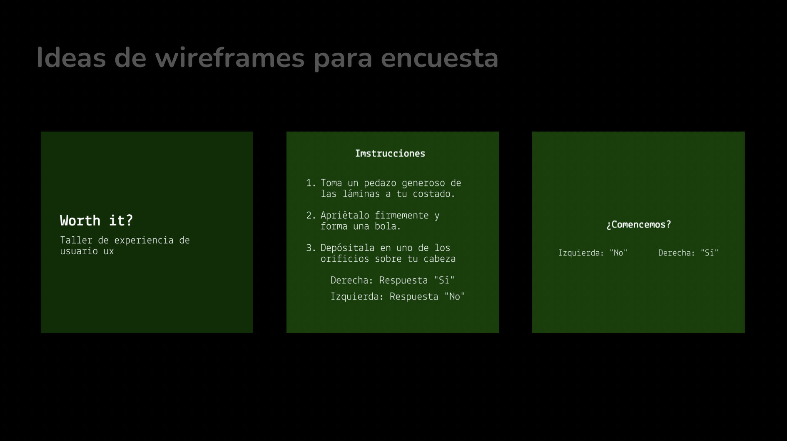
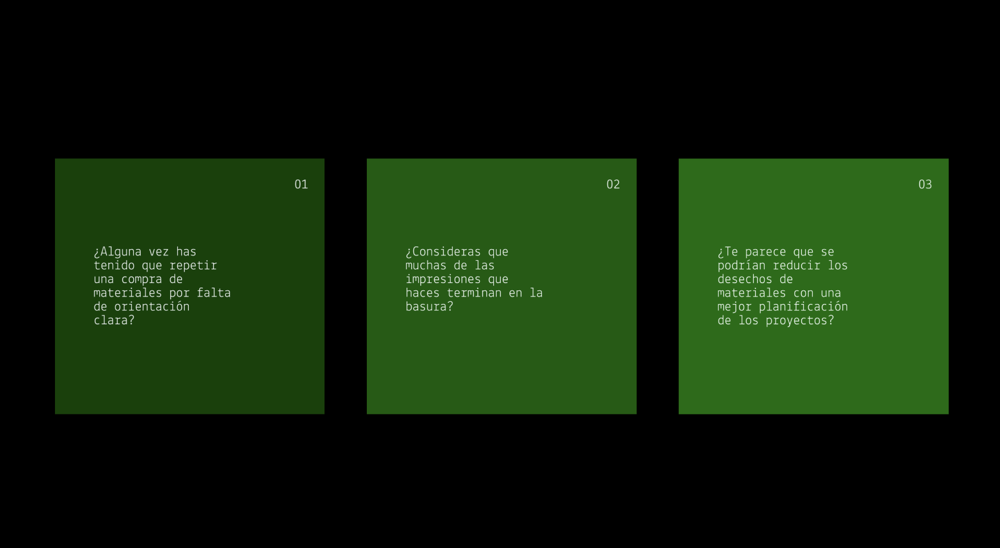
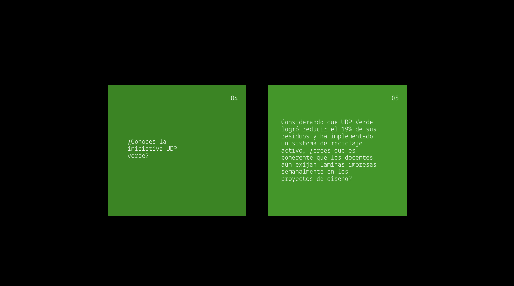
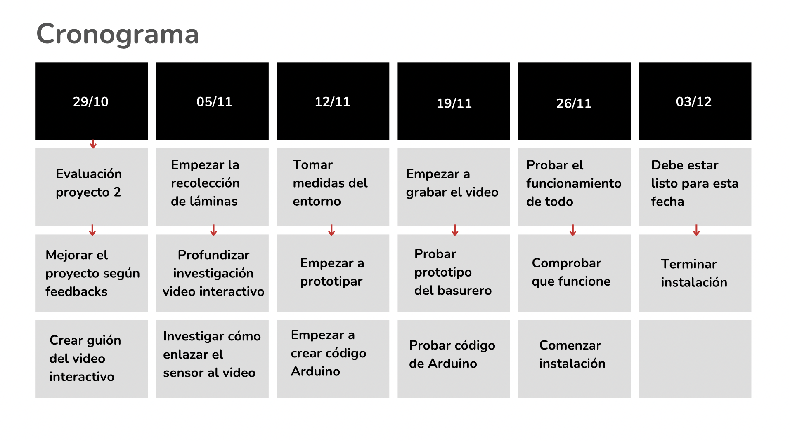

# clase-11

## fecha: 29 de Octubre 2024

## avance proyecto

nuestra principal dificultad fue unir la parte de la encuesta y lo que queríamos lograr con la parte física del proyecto. Pero teníamos claro que queríamos incorporar los desechos de proyectos de alumnos de la faad en nuestro proyecto, para darle mas fuerza y caracter, además de probar nuestra hipótesis.

llegamos a la idea de hacer un espacio cerrado, el usuario debe meter su cabeza a un basurero el cual estará pegado a la pared por medio de correderas, para que no sea incómodo y se ajuste a la altura del usuario. Dentro del basurero habrá una pantalla que te mostrar´pa un video narrativo-interactivo, con el cual irás respondiendo la encuesta. Por fuera del basurero habrán rollos de papel reciclado por nosotros, que haya sido desechado en la faad. Y este se utilizará para votar, luego de que la pregunta salga en la pantalla debes romper un trozo de papel y arrojarlo por encima de tu cabeza hacia dentro del basurero, depende de la dirección que escojas la respuesta será si o no.

### ¿Qué queremos lograr?

Exponer que los métodos de producción exigidos a los estudiantes en los encargos, como las impresiones, contribuyen a los excesivos gastos económicos que enfrentan los estudiantes en sus proyectos, lo que a su vez provoca una generación significativa de desechos, particularmente en el contexto del Diseño Abierto.

### Antecedentes - Acciones del estudiante 

“Decenas de pruebas inútiles, modelos obsoletos y prototipos mal gastados quedan a la deriva, sin ningún doliente aparente. La opción del “descarte” funciona proporcional a la cantidad de errores o demostraciones equivocas cometidas; no se puede pensar en un desarrollo sostenible siempre que el futuro profesional no mida las consecuencias de sus actos.” (López Morales, Javier Alfonso (2008). Manejo de residuos generados por estudiantes de diseño industrial. Grafías Disciplinares de la UCP, Pereira, Colombia. 
Pág. 219.)

### Antecedentes - El rol de las universidades

“El papel que deben desempeñar las universidades ante este panorama es preponderante, puesto que estas educan a la mayor parte de las personas que manejan las instituciones de una sociedad. Las universidades tienen responsabilidades profundas para incrementar la conciencia, conocimiento, tecnologías y herramientas para crear un futuro ambientalmente sostenible.” (Romero Esquivel, Luis Guillermo; Salas Jiménez, Juan Carlos; Jiménez Antillón, Joaquín (2008). Manejo de desechos en universidades. Estudio de caso: Instituto Tecnológico de Costa Rica. Tecnología en Marcha, Vol. 21, N.° 3, Pág. 33-41.)

### Antecedentes - UDP Verde

“En marzo de 2023, las autoridades de la Universidad anunciaban que tras el buen desempeño del plan piloto de reciclaje UDP Verde, iniciado en 2021 en la Facultad de Administración y Economía, ahora se extendía a gran parte de los edificios de Santiago Centro. Diez meses después, los reportes indicaron que la UDP recicló 19% de sus residuos, es decir, 20 toneladas. Su ecoequivalencia significó que se evitó el consumo hídrico de 2.131 casas en 1 día, se dejó de emitir a la atmósfera 23.876,8 kg. de CO2, se evitó el consumo eléctrico de 5.663,1 casas en 1 día, se impidió la tala de 856,9 árboles y se generaron 24,62 litros de fertilizante natural.” (Universidad Diego Portales. (12 de abril de 2024). UDP Verde: Conoce las cifras de marzo de 2024. Universidad Diego Portales. Recuperado de https://www.udp.cl/udp-verde-conoce-las-cifras-de-marzo-de-2024/.)

## Considerando que UDP Verde logró reducir el 19% de sus residuos y ha implementado un sistema de reciclaje activo, ¿crees que es coherente que los docentes aún exijan láminas impresas semanalmente en los proyectos de diseño?

## Hipotesis

Los excesivos gastos económicos, en consecuencia de los métodos en los proyectos de diseño de los estudiantes de la FAAD -> Podrían estar generando -> Mayor cantidad de materiales descartados, que terminan convirtiéndose en residuos.

### ¿Qué haremos para lograrlo?

A partir de los antecedentes y la revisión de la encuesta de taller de visualización de datos. Generaremos comparaciones y preguntas que puedan hacer cuestionar al Usuario Principal -> Estudiantes de la FAAD, Diego Portales.

### ¿Por qué lo haremos?

Con estos problemas y comparaciones mas que corroborar datos, queremos crear conciencia y generar un espacio reflexivo. Queremos que este problema se vuelva relevante y mediante la divulgación se tomen cartas en el asunto.

## Propuesta

Construiremos una capsula que comunique y plantee estas metodologías dañinas mediante cuestionamientos y verdades fundamentadas. Se usará un basurero reciclado y modificado. A los costados: Desechos de Laminas botadas que serán enrolladas por nosotros. 

## Mensaje metafórico

Adéntrate a un basurero a ver tu trabajo caer en el y ver tus propias laminas de “proceso” y  tu dinero en la basura.

## Lista de componentes

1. Arduino R4 Wifi
2. Protoboard
3. Sensores PIR HC-SR501 detector de movimiento
4. Cables
5. Pilas
6. Porta pilas

Escogimos el sensor de movimiento para detectar las respuestas de la encuesta mediante la acción de arrojar papel al basurero por encima de la cabeza del usuario.

## Casos borde

a) Usuario no responde a una pregunta
 
Solución: Después de un breve tiempo de espera, la pantalla podría mostrar un mensaje de "Recuerda responder la pregunta para continuar"
 
b) Usuario intenta retirar una respuesta ya depositada

Solución: Incluir un mensaje que explique que cada decisión es definitiva para reforzar el concepto de responsabilidad.

c) Sensor no detecta correctamente la respuesta

Solución: Mostrar en pantalla un mensaje de "Intenta de nuevo" si la respuesta no se detecta en unos segundos. 

d) El usuario decide abandonar la cápsula antes de completar el cuestionario:

## Preguntas encuesta

 1. ¿Alguna vez has tenido que repetir una compra de materiales por falta de orientación clara?
 2. ¿Consideras que muchos de los materiales que compras terminan siendo innecesarios?
 3. ¿Te parece que se podrían reducir los desechos de materiales con una mejor planificación de los proyectos?
 4. ¿Conoces la iniciativa UDP verde?
 5. Considerando que UDP Verde logró reducir el 19% de sus residuos y ha implementado un sistema de reciclaje  activo, ¿crees que es coherente que los docentes aún exijan láminas impresas semanalmente en los proyectos de diseño?

## Wireframes 

## Cronograma

