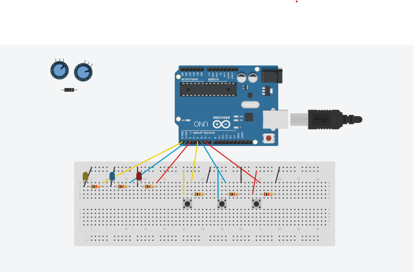
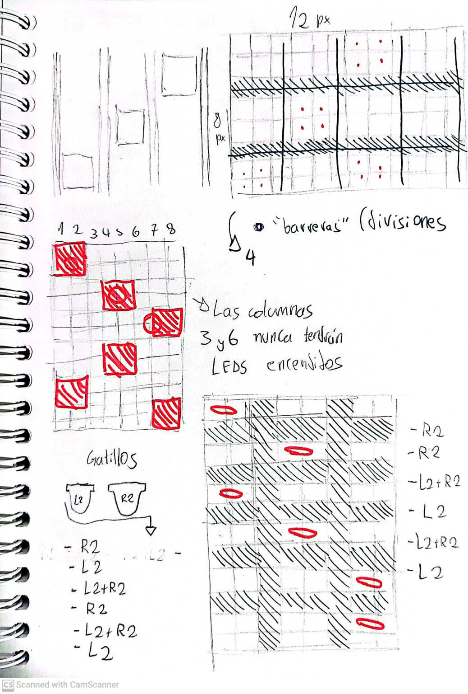
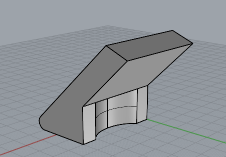
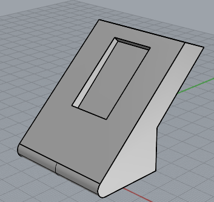

# clase-03
##Arduineación 1

Hoy comenzamos a definir lo conceptual y físico de nuestros objetos.

Propuesta: ¿Qué quiero pedirle al Arduino?

Explicación: Hay 3 casillas de las cuales 1 está "ON" y 2 están "OFF".

Cada casilla tiene un botón asociado. Al presionar un botón manda una señal a su respectiva casilla, la cual se apaga o enciende dependiendo de su estado anterior.

Una vez que se encuentrena apagadas todas las casillas, se pasa a la siguiente "etapa".

##AVACNCE 0.1.2

.

https://www.tinkercad.com/things/giOBoGTMZWH-exquisite-jaagub-gaaris/editel?sharecode=cyrerJqFRBJgO17nTo0HEt22Bv-Y0sGsiJkA3hiFBI0

.

#P R O G R E S O

. 
En estos croquis se exploran las posibilidades y limitaciones del display de 8x12 pixeles. Llegué a las siguientes conclusiones:

-Tiene que visualizarse una "división" entre cada uno de los 3 carriles para que se explicite su funcionamiento vertical.
-¿EN caso de haber 2 leds continuos en el mismo carril, se debe mantener presionado el gatillo? NO; y para evitar confusiones respecto a aquello, los leds que se enciendan también estaránn "divididos" en el eje horizontal.

POR ESTO, el tamaño de la luz encendida paso de ser de 2x2 a ser de 2x1.

.

En este croquis se explora la forma física de Heroe Guitarra.

Esquema de como se disponen las distintas "capas" de Heroe Guitarra

.

Iteración en la forma de explicar el funcionamiento de Heroe Guitarra, búsqueda por hablar el idioma que el arduino entienda.

. 

. 

. 
