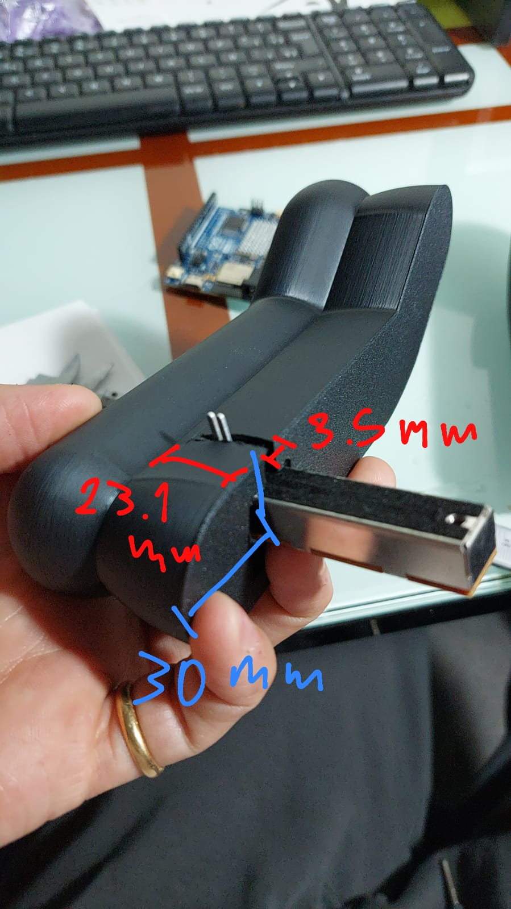
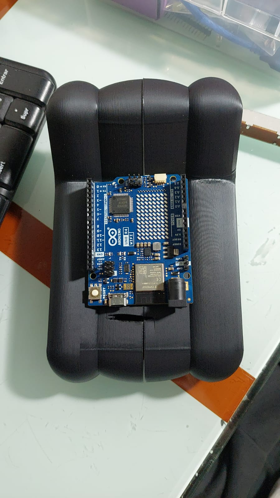

# clase-04

Presentamos el objeto:

#Feedback


1. Sensación Emocional
2. Lo bueno / Bien logrado
3. Lo malo / Poco claro
4. Referentes


I. Alanis.maria:
1. Sale de lo común
2. Ideación bien desarrollada, en cuanto la función
3. El tamaño


II. cata pinto:
1. Intrigante, no es algo común de vers y llama la atención su forma
2. Está bien pensado en cuanto a forma y angulación
3. siento que el tamaño es muy grande
4. no se me le ocurren referentes


III. morgan
1. Amo la forma, es como la cabeza de una guitarra :0000
2. amo como se hizo la ideación y la estructura esta muy interesante (enseñenme a usar rhino :333
3. No sabria como iria la pantalla y eso me confunde un poquito


IV. AbnerV
1. Me dan ganas de jugar.
2. Me encanta la forma curva  y la función de éste. 
3. Un poco más pequeño sería ideal


V. nori
1. creo que sorpresa y felicidad, me gusta mucho ver el proceso y que muestren tantas cosas, y me gusta mucho el guitar hero tambien 
2. me encanta que lo hayan hecho inspirado en el guitar hero, y la impresion se ve buena
3. no entendí como va a funcionar con botones o algo asi, y como se va a sostener el arduino en la impresión
4. aun no se me ocurren referentes :D


VI. paulita
1. vivo el objeto es muy ergonómico y tiene mucho movimiento 
2. el angulo del objeto me parece aporta mucho al juego hay super buena comprensión del referente 
3. me gustaría que implementaran de alguna forma un código de color como el que propone el juego en los gatillos
4. guitar hero para nintendo ds


VII. Karen
1. Emoción: “woaa” 
una forma extraña pero bacan!
2. Lo bueno: encuentro genial que se pueda 
sostener en las manos
3. Lo malo/poco claro: quizas falta pulir algunas partes 


VIII. T1ar3
1. Ya estoy emocionada de poder utilizarlo 
2. Destaco su forma y lo fácil de manipular 
3. Todavía no estoy muy clara como va la pantalla


IX. emjesus
1. me dan ganas de jugar
2. la forma está bien resuelta respecto al usuario, buen tamaño
3.  el color no me llama a jugar, usamos los pulgares? "descansan" en algún lado?


X. Sol Oyarce
1. Diferente, es distinto a las consolas comunes del mercado
2. El tamaño es adecuado para ambas manos 
3. La base esta un poco recta, se vería mejor un poco mas diagonal 
4. No tengo ningún referente que pueda aportar


XI. vale
1. objeto ergonómico, facil de usar
2. la forma es muy interesante, tiene coherencia con lo que comentan
3. ser mas cuidadosos con las terminaciones, quizas lijar.


XII. sofi olivares
me gusta la forma que le dieron, tiene mucho sentido a lo que quieren llegar
2. la forma es muy ergonómica y permite un buen uso del objeto, es comodo
3. la parte donde van los switch tiene unos bordes que molestan un poco a la hora de posicionar la mano


XIII. Belén🪼 
1. curiosidad
2. La forma está espectacular y el tamaño está muy bueno.
3. Eso si me lo imagino jugando más apoyado en una mesa
4. no tengo referente : (


XIV. juan pareschi. 
1. Interesado y emocionado, dado como resolvieron su proyecto y el tema que están trabajando
2. Se ve mucho avance y pensamiento detrás del objeto, rescato harto todo el detalle que se pudo ver del proceso y la multifuncionalidad del modulo actual
3. Falta definir mas claro como se interactua con el objeto (es estacionario o no, como  con el código los inputs), redefinir el input del carril del medio (al funcionar con los 2 botones, puede haber problemas de que el código lea bien los inputs por lo mismo)
4. Juegos de arcade de ritmo (buscar Pop'n'Music, Taiko no Tatsujin o japanese rhythm games arcade en google) o controles de juego en general, pensar sobre todo como el usuario toma e interactúa con el objeto


.

El modelo avanzó hacia una morfología más ergonómica, la cual permite un mejor agarre gracias a su tamaño disminuido respecto a la versión anterior.

Imprimí este prototpo de la forma para comprobar su comodidad y tamaño. Posteriormente utilicé un cuchillo cartonero, el cual calenté usando una mecha, para perforar el prototipo y ver en qué partes podrían ir los componentes. 

El objeto final se compondrá de:
-Carcasa impresa en 3D
-Arduino UNO r4 wifi
-Pushbutton(x2)
-Potenciómetro deslizante

Los cambios realizados responden a la nueva mecánica del juego. La versión actual del juego (v1.1.0) consiste en una mecánica de coordinación entre ambas manos. (como en el guitar hero original) Además, con la nueva morfología de heroeGuitarra se ahorra es materiales, costos, y tiempo de fabricación.

.

En el caso de Heroe Guitarra 1.1.0 el "strum bar" y los "fret buttons" son emulados por el potenciómetro y pushbutton respectivamente. De esta forma, el usuario, con el dedo pulgar de una mano debe seleccionar el carril donde se ejecutará la acción(con el potenciómetro) y con el dedo índice de la otra mano deberá ejecutar la acción(con el pushbutton). 

Estos cambios fueron inspirados por los comentarios e ideas de Paula y Juan (pixelitaa y starbrowser).

.
Medidas de la renura por la cual se asome la "perilla" del potenciómetro


.
Medida de donde va el pushbutton. (Si se traza una linea vertical desde donde termine la curva hasta efinal del objeto, es justo al medio)


.
Medidas grosores pushbutton


.
Medidas potenciómetro slicer(comprado en MCI electronics a 5.290 CLP
https://mcielectronics.cl/shop/product/potenciometro-lineal-de-10kohm-10242/


.
Imagen explicativa de donde iria el arduino, y la pantalla.

MÁS AVANCES

https://roboticsbackend.com/arduino-control-led-brightness-with-a-potentiometer/

https://www.youtube.com/watch?v=TURzbXTNaA0

```ino
/*
  Single Frame
  
  Displays single frames using matrix.loadFrame
  
  See the full documentation here:
  https://docs.arduino.cc/tutorials/uno-r4-wifi/led-matrix
*/

#include "Arduino_LED_Matrix.h"  // Include the LED_Matrix library
#include "framesv2.h"              // Include a header file containing some custom icons
int potPin = A0;
ArduinoLEDMatrix matrix;  // Create an instance of the ArduinoLEDMatrix class
int botonWeno = 2;
int botonValue;

void setup() {
  Serial.begin(115200);  // Initialize serial communication at a baud rate of 115200
  matrix.begin();        // Initialize the LED matrix
  pinMode(botonWeno, INPUT);

}

void loop() {

  int potValue = analogRead(potPin);
  // Load and display the "chip" frame on the LED matrix

  int carril = map(potValue, 0, 1023, 0, 2);

  if (potValue > 140 && potValue < 401) {
    matrix.loadFrame(ogIzq);

  }

  // Load and display the "danger" frame on the LED matrix
  else if (potValue > 400 && potValue < 639) {
    matrix.loadFrame(ogMed);
  }

  // Load and display the "happy" frame on the LED matrix
  else if (potValue > 638 && potValue < 890) {
    matrix.loadFrame(ogDer);

  }

int botonValue = digitalRead(botonWeno);

 if(botonWeno == HIGH) {
   matrix.loadFrame(finFase1);
}

}
```
En este còdigo, con el slider puedo sleccionar el carril. El paso siguiente es que al apretar el boton en el carril ocrrecto, se apague el led.
 


