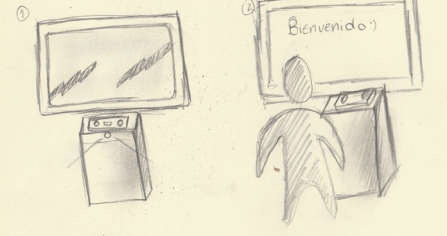

## clase-11

# Temática y contextualización a nivel nacional
Nuestro proyecto aborda el estrés de la carga acádemica y como este afecta la vida de les alumnes. 
Estudio reciente (2018) en Chile, realizado por la Universidad Andrés Bello (UNAB) y la Universidad de las Américas, reveló que una proporción significativa de estudiantes universitarios presenta síntomas de estrés y otros problemas de salud mental como la ansiedad y la depresión. Según la investigación, el 57% de los estudiantes reportó haber experimentado estrés académico, una cifra elevada que destaca las dificultades y demandas emocionales a las que se enfrentan en sus entornos académicos. Además, más de el 10% dentro del porcentaje de estudiantes estresados, han dicho querer suicidarse debido a tanta carga y la falta de atención de salud psicologica. 

# Descripción de proyecto
Nuestro objetivo es visibilizar ante las autoridades de la Escuela de Diseño de la Universidad Diego Portales sobre el impacto del estrés derivado de la carga académica en sus estudiantes. A través de este proyecto, buscamos crear un espacio donde los estudiantes puedan expresar su experiencia, comprendan que no están solos en estos desafíos y visibilicen esta problemática de manera colectiva y efectiva.

A través de una recopilación de datos interactiva basada en un sistema de votación sencilla, que permitirá medir y visualizar el nivel de estrés que genera la carga académica, acumulado en los estudiantes en tiempo real. 

### Introducción Visual con la Gráfica de Ikeda: 
Al iniciar la interacción, se mostrará una pantalla con la Gráfica de Ikeda, que no solo captará la atención del usuario, sino que ofrecerá una representación simbólica de los efectos del estrés en el cerebro humano. La gráfica se utilizará para ilustrar cómo el estrés académico, la ansiedad y la tensión afectan a los estudiantes, resaltando visualmente el peso de estas presiones. 
(boceto de  la pantalla, ubicación, espacio, tamaño, visualizar montaje)

 
Por qué ocupar la gráfica de ikeda 

Uso de datos para crear experiencias inmersivas
El público se convierte parte de la obra
Estética minimalista - visualización de datos como arte
Busca hacer una excavación profunda en la creación de sonidos mediante algoritmos. 

Su gráfica hace uso de datos en tiempo real, la utilización de su gráfica nos ayudará a llamar la atención de una manera más innovadora y que las personas hagan consciencia de su estrés de una manera distinta.

### Cuestionario Interactivo y gráfica
Luego se mostrará en pantalla un saludo y una breve introducción para después seguir con las preguntas.  
Las preguntas de este cuestionario están diseñadas para reflejar distintas dimensiones del estrés académico, tales como:
Dificultad para gestionar el tiempo.
Conflictos entre los estudios y la vida personal.
Presión por alcanzar metas y expectativas personales.
Falta de empatía de los académicos respecto a la carga de trabajo.

ejemplo concreto de preguntas: 
¿Crees que necesitas más tiempo para cumplir con tus proyectos?
¿Te resulta difícil balancear tus estudios con actividades personales?
¿Te sientes presionado/a por cumplir con fechas límite?
¿Has sentido alguna vez que no puedes alcanzar tus propias expectativas en los Exámenes, solemnes etc?
¿Has notado que te sientes más cansado/a de lo normal después de preparar solemnes para D.A?

Estás preguntas se relacionan estrictamente con indicadores de estrés elevados, ya que todas estás situaciones que presentamos ayudan a establecer una conexión directa que genera el estrés académico, ya que son situaciones que genera síntomas emocionales que son parte del estrés, como ansiedad, frustración, cansancio, insomnio. procrastinación, etc.

Dibujo técnico de panel con dos botones de arcade tamaño jumbo

 

