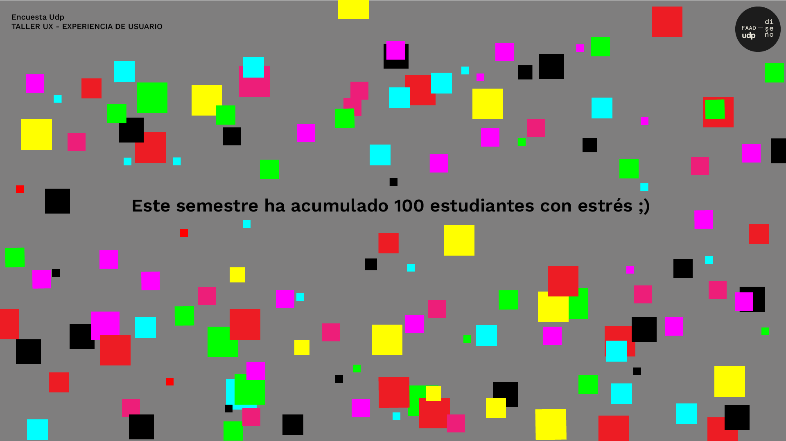
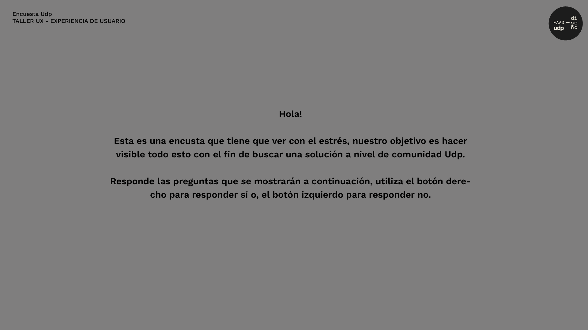
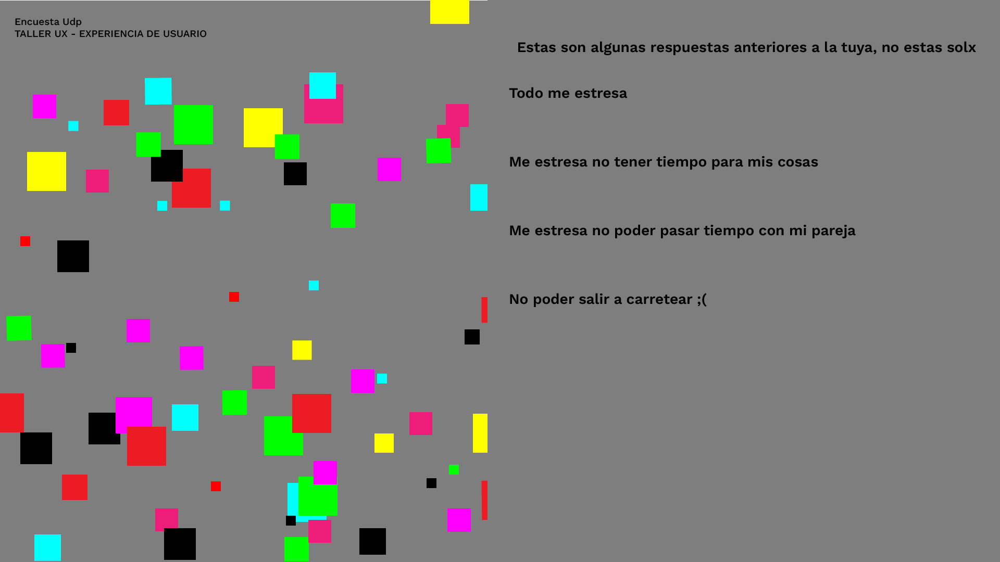
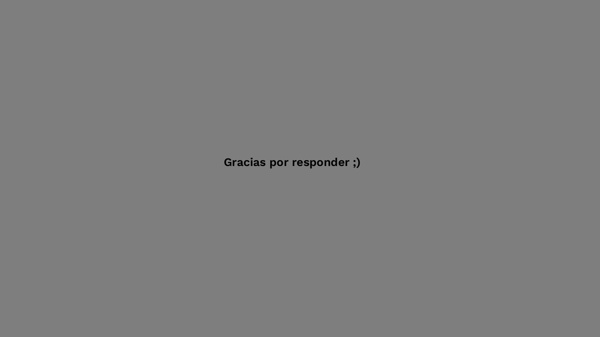
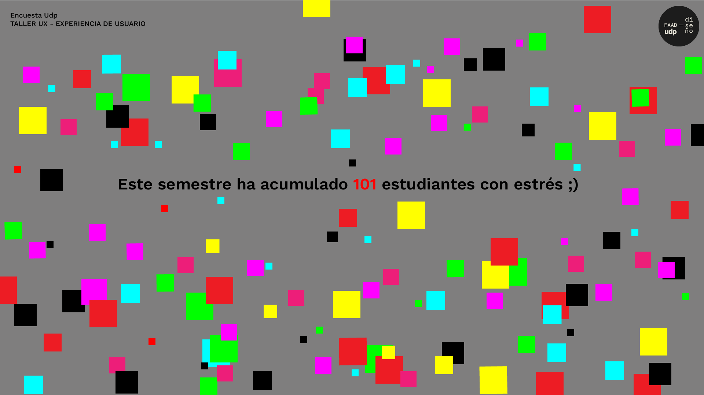
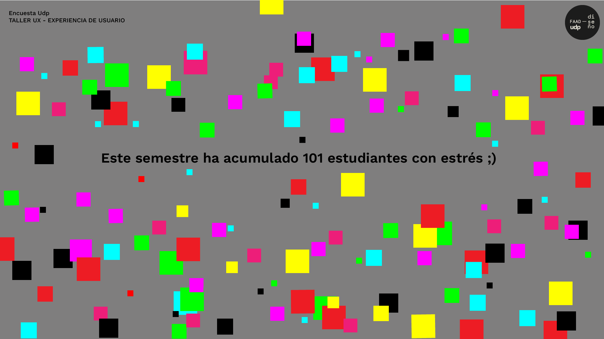

# clase-13

## Qué es pseudocódigo?

[fuente](https://openwebinars.net/blog/que-es-pseudocodigo/)

Es una manera informal de escribir un código, se utiliza lenguaje natural que imita la lógica utilizada en el programa, es un puente de ideas para escribir el código que está destinado a ser ejecutado.
Se emplean palabras comunes, como “si”, “sino”, “mientras”, “repetir”, para describir acciones y decisiones. Al ser escrito de esta manera, el pseudocódigo permite centrarse en los pasos lógicos en lugar de los detalles de la implementación técnica. :)

## pseudocódigo

   INICIO
    votosSi ← 0
    respuestas ← crear arreglo para almacenar 
    respuestaEscrita ← 0
    tiempoInicio ← 0

    DEFINIR detectPresencia COMO entrada (input)
    DEFINIR botonSi COMO entrada (input)
    DEFINIR teclado COMO salida (output)

    MOSTRAR "Pantalla de inicio con gráfica de acumulación y frase: "Este semestre ha acumulado x estudiantes con estrés :)""

    ESPERAR (7, 10, 15) segundos (probar)

    MIENTRAS VERDAD
        SI detectPresencia ESTÁ ACTIVO
            tiempoInicio ← TIEMPO ACTUAL
            MOSTRAR "Pantalla de inicio con gráfica de acumulación y frase: "Este semestre ha acumulado x estudiantes con estrés :)""
            ESPERAR 5 SEGUNDOS

            MOSTRAR "Esta es una encuesta relacionada con el estrés académico 
            MOSTRAR "¿Sientes que el estrés académico ha tomado el control sobre tu vida?"
            MOSTRAR "Presiona el botón derecho para Sí"

            SI botonSi ESTÁ ACTIVADO ENTONCES
                votosSi ← votosSi + 1 (incrementa y se acumula)
                ENVIAR_CORREO "correo va cambiando según la cantidad de personas que vayan a responder"
                MOSTRAR "acumulación de datos y número en frase"

                MOSTRAR "¿Quieres compartir lo que te estresa con nosotros?"
                SI botonSi ESTÁ ACTIVADO ENTONCES
                    ACTIVAR teclado
                    MOSTRAR "Despliega el teclado que se encuentra bajo el panel de botones y escribe tu respuesta"
                    RESPUESTA ← ESCRITA 
                    GUARDAR RESPUESTA EN respuestas[respuestaEscrita]
                    respuestaEscrita ← respuestaEscrita + 1 (guardar respuesta)

                    MOSTRAR "Respuestas compartidas:"
                    MOSTRAR TODAS LAS RESPUESTAS EN respuestas
                    ESPERAR 30 segundos
                FIN_SI
            SINO
                MOSTRAR "Gracias por responder"
            FIN_SI

            ESPERAR 10 segundos
            MOSTRAR "Pantalla de inicio"
    FIN_MIENTRAS
FIN

## cataclismo aventuras (me explotó la cabeza (aún estoy aprendiendo))

El fin de semana me di cuenta de que podía hacer todo lo que se verá en pantalla en p5.js (no lo sabía ok:(), la cosa es que he estado leyendo y leyendo dentro de los tutoriales que hay en la página y la lógica de código que utiliza en el libro que escribí la clase pasada yyy, he logrado akgunas cosas (de verdad no sabía nada), pensé que iba a lograr sacar los wireframes desde ahí pero no lo logré je (los haré en ai). Quizá lo logre igual pero en otro momento porque necesito un descanso uu. Les dejo el código que hice en p5.js (en verdad es para que no se me pierda a mi). 

```
let votosSi = 0; 
let respuestas = []; // almacen de escritos
let estado = "inicio";  
let tiempoInicio; 

function setup() {
  createCanvas(600, 400);
  background(200);
  textAlign(CENTER, CENTER); 
  textSize(15);
}

function draw() {
  background(200);

  if (estado === "inicio") {
    mostrarPantallaInicio();
  } else if (estado === "instrucciones") {
    mostrarInstrucciones();
  } else if (estado === "pregunta1") {
    mostrarPantallaPregunta("¿Sientes que el estrés académico ha tomado el control sobre tu vida?");
  } else if (estado === "pregunta2") {
    mostrarPantallaPregunta("¿Quieres compartir lo que te estresa con nosotros?");
  } else if (estado === "respuestas") {
    mostrarRespuestas();
  }
}

function mostrarPantallaInicio() {
  textSize(20);
  fill(0);

  // para los cuadrados 
  let offset = (10, 20, 30, 40,50, 100, 110, 120)
  for (let i = 0; i < votosSi; i++) {
    fill(255, 255, 255);
    rect(offset, height - 150, 20, 20); 
    offset += 25;
    noStroke();
   
  }

  // respuestas escritas    
  fill(0);
  text(`Este semestre ha acumulado ${votosSi} personas con estrés`, width / 2, height / 2);
  text("Presiona ESPACIO para continuar", width / 2, height - 50);
}

function mostrarInstrucciones() {
  textSize(18);
  fill(0);
  text("Instrucciones:", width / 2, 50);
  text("1. Responde a las preguntas con el mouse y Enter.", width / 2, 100);
  text("2. Puedes compartir tu experiencia después de responder.", width / 2, 140);
  text("Presiona cualquier tecla para continuar.", width / 2, height - 50);
}

function mostrarPantallaPregunta(pregunta) {
  // acumulación de datos
  let offset = 100;
  for (let i = 0; i < votosSi; i++) {
    fill(100, 150, 255);
    noStroke();
    rect(offset, height - 150, 20, 20);
    offset += 25;
    noStroke();
  }
  fill(0);
  textSize(16);
  text(`Este semestre ha acumulado ${votosSi} personas con estrés`, width / 2, height - 50);

  // superposición de encuesta
  fill(180); // Fondo gris del panel
  rect(width / 2, 0, width / 2, height);
  noStroke();

  // pregunta
  fill(0);
  textSize(18);
  text(pregunta, (3 * width) / 4, height / 2 - 30);

  // esto en la final no va pero es por la experiencia
  textSize(16);
  fill(100, 255, 100);
  text("Haz clic para responder 'Sí'", (3 * width) / 4, height / 2 + 20);
  fill(255, 100, 100);
  text("Presiona Enter para responder 'No'", (3 * width) / 4, height / 2 + 50);
}

function mostrarRespuestas() {
  textSize(18);
  fill(0);
  text("Respuestas compartidas:", width / 2, 50);

  // Mostrar las respuestas almacenadas
  textSize(16);
  let y = 100;
  for (let i = 0; i < respuestas.length; i++) {
    text(respuestas[i], width / 2, y);
    y += 30;
  }

  text("Volviendo a la pantalla inicial en 1 segundo...", width / 2, height - 50);


  if (millis() - tiempoInicio > 1000) {
    estado = "inicio";
  }
}

function mousePressed() {
  if (estado === "pregunta1") {
    votosSi++;
    estado = "pregunta2";
  } else if (estado === "pregunta2") {
    // Quiere compartir
    let respuesta = prompt("Escribe lo que te estresa:");
    if (respuesta) respuestas.push(respuesta);
    estado = "respuestas";
    tiempoInicio = millis();
  } else if (estado === "instrucciones") {
    estado = "pregunta1";
  }
}

// Manejar teclado
function keyPressed() {
  if (estado === "inicio" && keyCode === 32) {
    estado = "instrucciones";
  } else if (estado === "pregunta1" && keyCode === ENTER) {
    estado = "inicio";
  } else if (estado === "pregunta2" && keyCode === ENTER) {
    // No quiere compartir
    estado = "inicio";
  }
}

```

## wireframes en orden 














## correcciones

En pantalla, resolver bien lo que se va a mostrar y en qué momento se va a mostrar ¿qué logica sigue la gráfica de inicio? resolver, puede ser mostrando aleatoriamente las respuestas guardadas. 

Resolver la disposicón de teclado y botones, no es taan buena idea hacer un podio.

