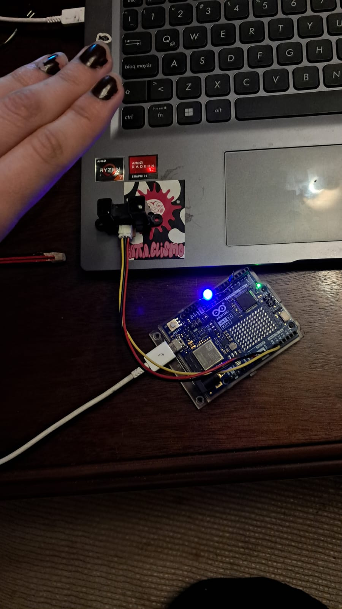
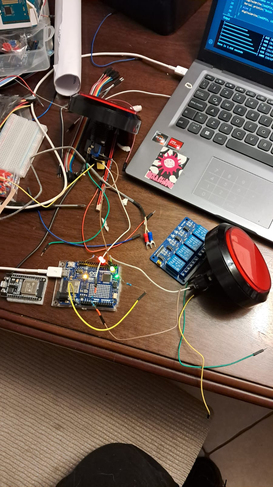

# Avances 

He estado dejando taller muy de lado por temas personales y otras cosas y me arrepiento, je

## Objetivo del día de hoy: Conectar Arduino con p5.js

Estuve viendo como hacer todo y llegué a partes en las que no entendí nada de nada. 
Viendo un tutorial en youtubr, entendí muchas cosas y me acordé de muchas otras que vimos en la clase de wifi. 
Básicamente, para hacer que arduino interactúe con p5, hay que hacer un puente ya que, al estar ejecutando p5 en la web, existen limitaciones de seguridad entonces, la comunicación serial entre estos dos es imposible (cuek). 

Lo que si se puede hacer son los socket, los cuales permiten que los programas se comuniquen entre sí vía wifi o por el mismo pc. Normalmente para esto se utiliza Node.js pero, según el caballero del tutorial, se puede hacer directamente a la web.

Lo primero que se debe hacer es conseguir la aplicación serial p5 [link](https://github.com/p5-serial/p5.serialcontrol/releases/tag/0.1.2), luego de eso se abre la app que funcionará como puente entre el arduino y p5, revisar el puerto en el que esta conectado el arduino con eso se ve la info del sensor que él estaba usando. Siempre y cuando esté conectado y abra, el programa sirve como puente a través de un socket interno que se puede usar en el p5, usando la biblioteca en serie p5,, dentro de p5 en el archivo index.html se vinculan las bibliotecas.

## Mientras hago una pausa para procesar información: Prueba de componentes :)

1.Sensor: Detectar a alguien dentro de un rango de distancia específico para prender una luz (en el examen tiene la tarea de hacer que reaccione la pantalla pero se me hace más fácil asignarle tareas con las que ya había trabajado para luego ver como funciona y asignarle otra tarea) 

```

const int sensorPin = A0; 
const int ledPin = 4;     


const int umbralMin = 200;
const int umbralMax = 600;  // valor analógico para que detecte alguien cerca

void setup() {
  pinMode(ledPin, OUTPUT); // output porque responde a lo que recibe el sensor
  Serial.begin(9600);      // depuración serial
}

void loop() {
  int sensorValue = analogRead(sensorPin); // lee el valor de manera análogica
  Serial.print("Valor del sensor: ");
  Serial.println(sensorValue);            

  // condición, si hay alguien cerca se enciende el LED
   if (sensorValue >= umbralMin && sensorValue <= umbralMax) {
    digitalWrite(ledPin, HIGH);   
  } else { 
    digitalWrite(ledPin, LOW);    
  }


}

```


https://github.com/user-attachments/assets/97427064-9cb4-46b1-b2ba-36344eee65a4




Me falta calibrar un poquito pero ahí vamos

2. Botones: Les di la función de hacer que se encienda un led si el botón está presionado.
```
   const int button1Pin = 2;  
const int button2Pin = 3;  
const int led1Pin = 4;    
const int led2Pin = 5;    

void setup() {
  pinMode(button1Pin, INPUT); 
  pinMode(button2Pin, INPUT); 
  pinMode(led1Pin, OUTPUT);   
  pinMode(led2Pin, OUTPUT);   
  Serial.begin(9600);         
}

void loop() {
  int button1State = digitalRead(button1Pin); // estado de botón
  int button2State = digitalRead(button2Pin); // estado de botón
  
  if (button1State == HIGH) {
    digitalWrite(led1Pin, HIGH); // si se presiona se prende el led 1(rojo)
    Serial.println("Botón 1 presionado");
  } else {
    digitalWrite(led1Pin, LOW);  
  }

  if (button2State == HIGH) {
    digitalWrite(led2Pin, HIGH); // si se presiona se prende el led 2 (amarillo)
    Serial.println("Botón 2 presionado");
  } else {
    digitalWrite(led2Pin, LOW);  
  }
}
```

https://github.com/user-attachments/assets/c7fe4e92-e36b-417e-bec8-6c86a49282cf

Me pasó lo mismo que le había pasado con anterioridad a ptrp grupo, el botón por nada empezó a funcionar como sensor. 
Un pequeño detalle que verán en el video es que la función que le dí a esto está pasando al revés pero es porque las resistencias que le puse a los botones son menores a las que necesito (saqué todo antes de que pasara algo) 

