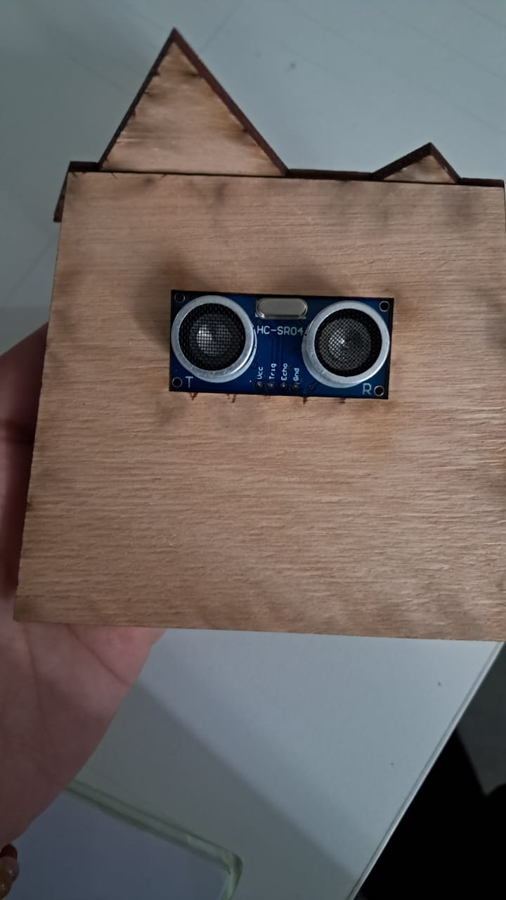

# clase-05


## Qué es

Es un juguete en forma de casa inspirado en la casa de UP, hecho con madera terciada y corte láser, y pintado para que tuviera aún mas similitud con la casa original. Funciona mediante un sensor ultrasónico, el cual si no detecta presencia mantiene prendido un led rojo y muestra la animación de un globo en modo de espera, y al detectar proximidad apaga el led y comienza la animación de la casa subiendo y bajando.

## Diseño


Primera casa: En esta primera instancia teníamos en sensor en el techo de la casa, pero gracias a los feedback decidimos mover el sensor hacia abajo de la casa, pensando que esta estaría pegada en la pared, y junto con el led este invita al usuario a interactuar con la parte de abajo de la casa




De acuerdo a las correcciones hechas por el equipo en general, decidímos agregarle color a la fachada de la casa para que fuera más apegada a la casa original (de la película). 

Se agregó una luz led roja para indicar su uso y el sensor se dejó en la parte trasera en la base de la casa. 

 

 

Para el espacio del sensor me equivoqué por tres milimetros y solo calza bien una parte :(, pero todo tiene solución!


## Diagrama de flujo

Tarea: Hacer funcionar la pantalla en la puerta de la casa.

1. Asegurate de que la pantalla esté quieta mostrando la imagen de un globo y la luz led en la base de la casa esté encendida.
2. Para que la pantalla reaccione debes acercar tu mano a la base de la casa.
3. Una vez se apague la luz led en la base de la casa, la pantalla empezará a mostrar la animación de una casa que sube y baja.
4. Dependiendo de la distancia de tu mano con la base de la casa, la animación de la casa se muestra (si está a menos de 20cm) o la animación del globo junto con el led (si está a más de 20cm)

## Lento y seguro

Código de prueba para luz led externa

```cpp
int pinred = 11;
void setup() {
  // put your setup code here, to run once:
 pinMode(pinred, OUTPUT);
}

void loop() {
  // put your main code here, to run repeatedly:
digitalWrite(pinred, HIGH);
delay(1000);
digitalWrite(pinred, LOW);
delay(1000);
}
```

Videos que me han servido mucho: 
[funcionamiento de luces led](https://youtu.be/yOEjuyvK62k?feature=shared)

[como funciona el sensor HC-SR04](https://youtu.be/xFZCpR-5xg4?feature=shared)

[cosas que no habia entendido](https://youtu.be/aA5ZpFySimw?feature=shared) 

## avance de código completo 

Aún está el detalle de que, si uno acerca la mano aún dejandola a una distancia de la casa, el sensor no la toma, peri si cubro el sensor con la mano, si la toma y luego funciona bien.

```cpp
// Incluir librerías para trabajar con la matriz LED
#include "Arduino_LED_Matrix.h"
#include "globito.h"
#include "animation.h"

ArduinoLEDMatrix Pantalla;  // Instancia del objeto

enum State {
  STANDBY,
  ACTIVO
};

const int ledPin = 13;

// Pines para el sensor de proximidad
const int pin_trig = 2;
const int pin_echo = 4;
int distance;

// Configuración de distancias para activar el LED
const int noHayNadie = 60;  // Encender el LED 13 desde los 21 cm
const int noHayNadie2 = 100;  // Seguir encendido el LED hasta los 100 cm
const int hayAlguien = 0;     // Apagar el LED y comenzar la animación de la matriz desde los 0 cm
const int hayAlguien2 = 20;    // Seguir encendida la pantalla hasta los 20 cm
// cuando no hay nadie esta prendido el led rojo y al detectar distancia se apaga

State currentState = STANDBY;

void setup() {
  Pantalla.begin();
  pinMode(pin_trig, OUTPUT);
  pinMode(pin_echo, INPUT);
  pinMode(ledPin, OUTPUT);

  Serial.begin(115200);
}

void loop() {
  readDistance(); // Lee la distancia del sensor

  switch (currentState) {
    case STANDBY:
    //aqui se reproduce la animacion del globito en espera y el led se mantiene prendido
      Serial.println("En estado STANDBY");
    
      if (distance >= noHayNadie && distance <= noHayNadie2) {
        digitalWrite(ledPin, HIGH);
        Pantalla.loadSequence(globito);  
        Pantalla.play(true);
        currentState = STANDBY;
      } else {
        currentState = ACTIVO; 
      }
      break;
      // en estado satndby poner que se mantiene prendido el led

    case ACTIVO:
      Serial.println("En estado ACTIVO");

      if (distance >= hayAlguien && distance <= hayAlguien2) {
        digitalWrite(ledPin, LOW);
        Pantalla.loadSequence(animation);  
        Pantalla.play(true);
        currentState = ACTIVO;
      } else {
        currentState = STANDBY; 
      }
      break;
  }
}

void readDistance() {
  digitalWrite(pin_trig, LOW);
  delayMicroseconds(2);
  digitalWrite(pin_trig, HIGH);
  delayMicroseconds(10);
  digitalWrite(pin_trig, LOW);
  
  long duration = pulseIn(pin_echo, HIGH);
  distance = duration * 0.0344 / 2;  // Convertir a centímetros
}
```
## Corrección código

```cpp

// Configuración de distancias para activar el LED
const int noHayNadie = 21;  // Encender el LED 13 desde los 21 cm
const int noHayNadie2 = 100; // Seguir encendido el LED hasta los 100 cm
const int hayAlguien = 20;  // Apagar el LED y comenzar la animación de la matriz desde los 20 cm
const int hayAlguien2 = 40; // Seguir encendida la pantalla hasta los 40 cm
// cuando no hay nadie esta prendido el led rojo y al detectar distancia se apaga

```


He estado estudiando un poco más ya que no entendía nada, ahora, gracias a las recomandaciones de mis compañeros en el ds me he podido enchufar jeje. 

 

